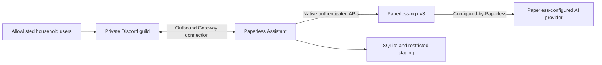

# Paperless Assistant architecture

Status: Discord-first MVP with durable per-file AI review
Last updated: 2026-07-29

## 1. Purpose

Paperless Assistant provides a private household Discord experience over Paperless-ngx. Its target
capabilities are native Paperless document chat, referenced document delivery, and immediate
multi-file ingestion with uploader-reviewed Paperless AI metadata suggestions. Paperless owns OCR,
classification, storage, search, LLM execution, and AI configuration.
The assistant owns Discord authorization, workflow policy, reliability, privacy-minimized audit,
and delivery decisions.

Issue #9 established the private runtime after retiring Gemini Spark/MCP. Issue #10 added the
outbound Discord worker, Paperless adapter, application services, and durable local state. Issue
#65 hardens authorization, credentials, diagnostics, cleanup, CI, and Paperless 3.0.4 AI review.
Issues #44 and #70 complete selective review, confirmed taxonomy creation, and cache validation.
Issue #77 makes review-field exposure and the extra creation prompt deployment policy while
preserving application-layer write enforcement.
Issue #79 separates each attachment into a durable per-file review and makes shared batch cleanup
depend on explicit resolution.
Issue #81 makes per-file rendering idempotent and removes resolved or safely orphaned review
artifacts.
Issue #43 replaces document-result dismissal with owner-only native Paperless similarity search.
Issue #83 couples explicit, confirmed AI review saves to exact Paperless tag finalization while
preserving a durable Discord-notification cleanup gate.

## 2. System context



Discord, Paperless, and state flows are implemented in issue #10.

## 3. Runtime and exposure

One `paperless-assistant` container is the primary runtime. Discord connects outbound through the
Gateway. There is no public webhook, HTTP interaction, MCP, OAuth resource, Spark, or Pangolin
route.

The ASGI health surface exposes:

- `/healthz`: liveness while the process can serve;
- `/readyz`: lifecycle and dependency-policy readiness;
- `/`: non-secret service metadata.

Compose binds optional host access to NAS loopback only. Container health checks use the
container-local listener.

## 4. Ports and adapters

- inbound Discord adapter: validates transport identity, posts one bounded metadata parent and
  public review thread per upload attachment, renders references, owner-only similarity actions,
  and AI review controls, and enforces uploader ownership on every metadata-write interaction;
- application services: authorize users and enforce query, delivery, ingestion, suggestion
  similarity, freshness/tag merging, batch inbox polling, and confirmed cleanup policy;
- Paperless gateway: the only component that performs Paperless HTTP calls, including the
  synchronous 3.0.4 AI suggestion trigger, native `more_like_id` search, and bounded diagnostic
  logging;
- ingestion and audit repositories: durable SQLite implementations tracking exact message/channel
  cleanup targets and confirmation state; one dedicated serialized worker keeps all SQLite
  operations and connection lifetimes off the Discord event loop;
- delivery adapter: stages and sends Discord files or returns authenticated Paperless links.

Domain and application code do not import Discord or HTTP client implementations.

## 5. Trust boundaries

1. **Discord to assistant:** messages, attachments, IDs, and interactions are untrusted until the
   exact guild, channel, and immutable user ID are authorized.
2. **Assistant to Paperless:** each user token and the system token are privileged credentials.
   Tokens are encrypted with a generated Fernet key and never cross into Discord, logs, audit,
   URLs, or local filenames. Revocation fails queued work closed without a system-token fallback.
3. **Paperless to its AI provider:** Paperless owns this configuration and data flow. The
   assistant invokes only Paperless's native APIs and holds no model-provider credential.
4. **Writable state:** SQLite, staged uploads, and delivery spools are restricted, bounded, and
   retention-managed. The root filesystem remains read-only.
5. **Discord retention:** questions, answers, status messages, and source attachments exist in
   Discord until policy cleanup removes them.

## 6. Security invariants

- Default deny for Discord guild, channel, user, DM, thread, bot, webhook, and edited-message
  routing.
- No public application route.
- No MCP, OAuth/JWT/JWKS, Spark, or Pangolin dependency.
- No taxonomy creation without an uploader's **Apply Changes** action, document delete,
  unrestricted metadata update, or user administration operation in application code. A second
  creation prompt is required by default and may be disabled by deployment policy.
- No tokens, authorization headers, document bytes, or audit payloads containing user content.
  Discord receives generic Paperless failures except for fixed guidance when a structured
  `duplicate_of` field definitively confirms a duplicate. Restricted server logs may contain a
  bounded, JSON-escaped, credential-redacted Paperless error body for operator diagnosis.
- Similar controls require the original requester's active thread context, use that requester's
  linked Paperless token, return at most three permission-filtered documents, and never repeat the
  source document.
- AI metadata writes require the original uploader, an enabled field, a fresh document-state
  check, serialized apply, bounded controls, and preservation of existing tags. Unmatched taxonomy
  names require an exact-name race check and a fresh Paperless `add_*` permission check; deployment
  policy controls whether creation also requires a second prompt.
- Each successful upload item retains owner-only **Open Paperless**, **Refresh**, **Save**, and
  **Finish & Close** behavior. The batch summary adds **Refresh All**, **Save All**, and **Close
  All**; bulk operations remain serialized and use the same per-document authorization,
  freshness, permission, audit, and verification checks.
- Only a confirmed individual Save or Save All item finalizes review tags. The application uses
  the durable job uploader's linked credential, removes the exact `CLEANUP_INBOX_TAG`, optionally
  adds one exact existing completion tag, preserves unrelated tags, re-fetches to verify, and
  records an audit outcome without tag names. Loading, refresh, retry rendering, cancel, close,
  recovery, and polling never initiate this write.
- A durable per-item finalization state blocks inbox cleanup while the tag operation is pending or
  needs reconciliation. Discord opens that gate only after delivering the successful Save
  response. An ambiguous mutation is re-fetched and reconciled without automatic retry.
- A rich per-file parent contains bounded metadata but no OCR or document content while its item is
  unresolved. Closing or dismissing an item deletes its thread and parent; independently confirmed
  cleanup flags make partial Discord failures retryable.
- Cleanup is fail-closed: Paperless batch failures do not delete Discord messages, and database
  evidence is purged only after Discord confirms deletion or absence at the exact channel/message.
- Shared upload source and summary messages become cleanup-eligible only when every success is
  closed, every terminal failure is manually dismissed, and no active or uncertain item remains.
- Unsafe POST requests are never retried after an ambiguous result.
- Container remains non-root, read-only, capability-free, and `no-new-privileges`.

## 7. Configuration

Configuration includes validated Discord, Paperless, persistence, limits, timeouts, retention,
and timezone policy.

Secrets are runtime-injected through a permission-restricted deployment environment and never
placed in source, image layers, tests, documentation examples, issues, or pull requests.

## 8. Persistence and recovery target

SQLite WAL storage holds ingestion jobs, a durable upload-batch graph with ordered item,
parent/thread/control-message, state, per-file cleanup, and shared-cleanup identifiers, Discord
event idempotency, short-lived
document-reference context, exact cleanup channel/message targets and confirmations, the
missing-tag warning ID/timestamp, per-item review-finalization cleanup gate, encrypted per-user
tokens, and privacy-minimized audit. Staged
files use job UUID names and restrictive permissions.

Each repository instance serializes migrations, queries, and transactions on one dedicated
database thread. Operation-scoped connections are created and closed on that same thread. Shutdown
stops new submissions and drains already-queued operations before joining the worker.

The target state machine is:

```text
staged -> submitting -> submitted -> succeeded | failed
                  \-> reconciliation_required
```

A saved Paperless task UUID resumes polling after restart. A crash in the ambiguous upload window
never automatically resubmits. Identical content in different Discord messages remains allowed;
only repeated processing of the same Discord event/job is suppressed.

Each upload item additionally progresses through pending/processing to succeeded, failed, or
reconciliation-required. A success becomes closed through per-file or batch close, and a failure
becomes dismissed only through explicit acknowledgement. Those terminal item states drive exact
shared-artifact cleanup and recovery of per-file controls.

## 9. Availability

Liveness is independent of Discord, Paperless, or the AI provider. Readiness represents whether
the worker can safely serve its configured capabilities. A missing required source tag disables
ingestion and degrades readiness without disabling search/download. Transient Paperless or AI
outages return bounded user-facing failures and must not cause destructive restart loops.
SQLite latency does not run on the Discord event loop, so a busy database cannot directly stall
heartbeats or unrelated interactions.

## 10. Deployment

The target is a Synology NAS using Docker Compose. The image is immutable except for a restricted
Docker-managed data volume whose stable Compose name survives container recreation and stack
renaming. A host bind mount remains an advanced operator option. Health access is loopback-only.
One worker replica is supported; horizontal scaling requires a new coordination and storage
design.

Deployment retains the previous known-good image and configuration for rollback. Database schema
changes use forward migrations and backups. Staged data is transient and excluded from backups;
SQLite job/audit state is included according to operator policy.

## 11. Decisions and roadmap

- ADR 0001: Python and uv remains accepted.
- ADR 0002: ports-and-adapters modular monolith remains accepted.
- ADR 0003: MCP transport is superseded.
- ADR 0004: phased, fail-closed capability delivery remains accepted.
- ADR 0005: separate Discord-worker assumptions are superseded in part.
- ADR 0006: Discord is the primary runtime.
- ADR 0007: native Paperless chat and immediate durable ingestion.
- ADR 0008: a Docker-managed volume is the zero-setup persistence default.
- ADR 0009: fail-closed AI metadata review, diagnostics, cleanup, credentials, and CI writeback.
- ADR 0010: complete selective AI review, confirmed taxonomy creation, and cache validation.
- ADR 0011: configurable review fields, persistent thread controls, and creation-prompt policy.
- ADR 0012: durable per-file review artifacts and explicit batch-resolution cleanup.
- ADR 0013: idempotent per-file rendering and resolved-artifact deletion.
- ADR 0014: owner-only native Paperless similarity from document results.
- ADR 0015: confirmed AI review tag finalization and notification-gated cleanup.
- ADR 0016: serialized SQLite execution off the Discord event loop.

Issue #10 is the canonical Discord MVP. Issue #20 corrects its default storage deployment. Issue
#65 is the July 2026 hardening and AI-suggestions correction. Issues #44 and #70 complete its
review UI and Paperless 3.0.4 integration contract. Issue #77 refines that review without changing
the Paperless endpoint or trust boundary. Issue #8 remains the broader least-privilege
Paperless permissions phase. A future inbound
interface, custom AI layer, public share-link capability, or additional user population requires
a separate issue and security review.
