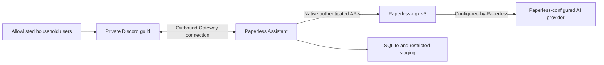

# Paperless Assistant architecture

Status: Discord-first MVP implemented by issue #10
Last updated: 2026-07-26

## 1. Purpose

Paperless Assistant provides a private household Discord experience over Paperless-ngx. Its target
capabilities are native Paperless document chat, referenced document delivery, and immediate
multi-file ingestion. Paperless owns OCR, classification, storage, search, and AI configuration.
The assistant owns Discord authorization, workflow policy, reliability, privacy-minimized audit,
and delivery decisions.

Issue #9 established the private runtime after retiring Gemini Spark/MCP. Issue #10 adds the
outbound Discord worker, Paperless adapter, application services, and durable local state.

## 2. System context



Discord, Paperless, and state flows are implemented in issue #10.

## 3. Runtime and exposure

One `paperless-assistant` container is the primary runtime. Discord connects outbound through the
Gateway. There is no public webhook, HTTP interaction, MCP, OAuth resource, Spark, or Pangolin
route.

The ASGI health surface exposes:

- `/healthz`: liveness while the process can serve;
- `/readyz`: lifecycle and dependency-policy readiness;
- `/`: non-secret service metadata.

Compose binds optional host access to NAS loopback only. Container health checks use the
container-local listener.

## 4. Ports and adapters

- inbound Discord adapter: validates transport identity, auto-creates public threads on top-level user messages in `#questions` and `#uploads`, renders document references as rich Discord embeds, routes thread-scoped context follow-ups, handles the `/clean` slash command, and provides interactive `Dismiss` buttons;
- application services: authorize users and enforce query, delivery, ingestion, inbox tag polling, and cleanup policy;
- Paperless gateway: the only component that performs Paperless HTTP calls (including document tag checks for auto-cleanup);
- ingestion and audit repositories: durable SQLite implementations tracking active upload notifications;
- delivery adapter: stages and sends Discord files or returns authenticated Paperless links.

Domain and application code do not import Discord or HTTP client implementations.

## 5. Trust boundaries

1. **Discord to assistant:** messages, attachments, IDs, and interactions are untrusted until the
   exact guild, channel, and immutable user ID are authorized.
2. **Assistant to Paperless:** the Paperless token is a privileged credential. It never crosses
   into Discord, logs, audit, URLs, or local filenames.
3. **Paperless to its AI provider:** Paperless owns this configuration and data flow. The
   assistant invokes only Paperless's native APIs and holds no model-provider credential.
4. **Writable state:** SQLite, staged uploads, and delivery spools are restricted, bounded, and
   retention-managed. The root filesystem remains read-only.
5. **Discord retention:** questions, answers, status messages, and source attachments exist in
   Discord until policy cleanup removes them.

## 6. Security invariants

- Default deny for Discord guild, channel, user, DM, thread, bot, webhook, and edited-message
  routing.
- No public application route.
- No MCP, OAuth/JWT/JWKS, Spark, or Pangolin dependency.
- No taxonomy creation, document delete, unrestricted metadata update, or user administration
  operation in application code.
- No questions, answers, captions, notes, OCR, document bytes, titles, filenames, taxonomy values,
  tokens, headers, or raw external responses in logs or audit.
- Unsafe POST requests are never retried after an ambiguous result.
- Container remains non-root, read-only, capability-free, and `no-new-privileges`.

## 7. Configuration

Configuration includes validated Discord, Paperless, persistence, limits, timeouts, retention,
and timezone policy.

Secrets are runtime-injected through a permission-restricted deployment environment and never
placed in source, image layers, tests, documentation examples, issues, or pull requests.

## 8. Persistence and recovery target

SQLite WAL storage holds ingestion jobs, Discord event idempotency, short-lived
document-reference context, cleanup-only message IDs, the missing-tag warning ID/timestamp, and
privacy-minimized audit. Staged files use job UUID names and restrictive permissions.

The target state machine is:

```text
staged -> submitting -> submitted -> succeeded | failed
                  \-> reconciliation_required
```

A saved Paperless task UUID resumes polling after restart. A crash in the ambiguous upload window
never automatically resubmits. Identical content in different Discord messages remains allowed;
only repeated processing of the same Discord event/job is suppressed.

## 9. Availability

Liveness is independent of Discord, Paperless, or the AI provider. Readiness represents whether
the worker can safely serve its configured capabilities. A missing required source tag disables
ingestion and degrades readiness without disabling search/download. Transient Paperless or AI
outages return bounded user-facing failures and must not cause destructive restart loops.

## 10. Deployment

The target is a Synology NAS using Docker Compose. The image is immutable except for a restricted
Docker-managed data volume whose stable Compose name survives container recreation and stack
renaming. A host bind mount remains an advanced operator option. Health access is loopback-only.
One worker replica is supported; horizontal scaling requires a new coordination and storage
design.

Deployment retains the previous known-good image and configuration for rollback. Database schema
changes use forward migrations and backups. Staged data is transient and excluded from backups;
SQLite job/audit state is included according to operator policy.

## 11. Decisions and roadmap

- ADR 0001: Python and uv remains accepted.
- ADR 0002: ports-and-adapters modular monolith remains accepted.
- ADR 0003: MCP transport is superseded.
- ADR 0004: phased, fail-closed capability delivery remains accepted.
- ADR 0005: separate Discord-worker assumptions are superseded in part.
- ADR 0006: Discord is the primary runtime.
- ADR 0007: native Paperless chat and immediate durable ingestion.
- ADR 0008: a Docker-managed volume is the zero-setup persistence default.

Issue #10 is the canonical Discord MVP. Issue #20 corrects its default storage deployment. Issue
#8 is the future least-privilege and Paperless permissions hardening phase. A future inbound
interface, custom AI layer, public share-link capability, or additional user population requires
a separate issue and security review.
