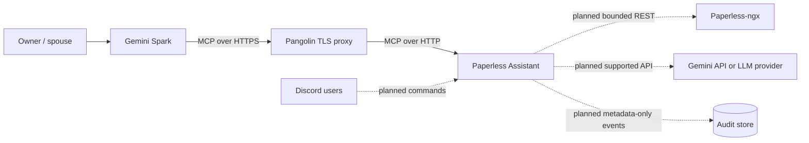
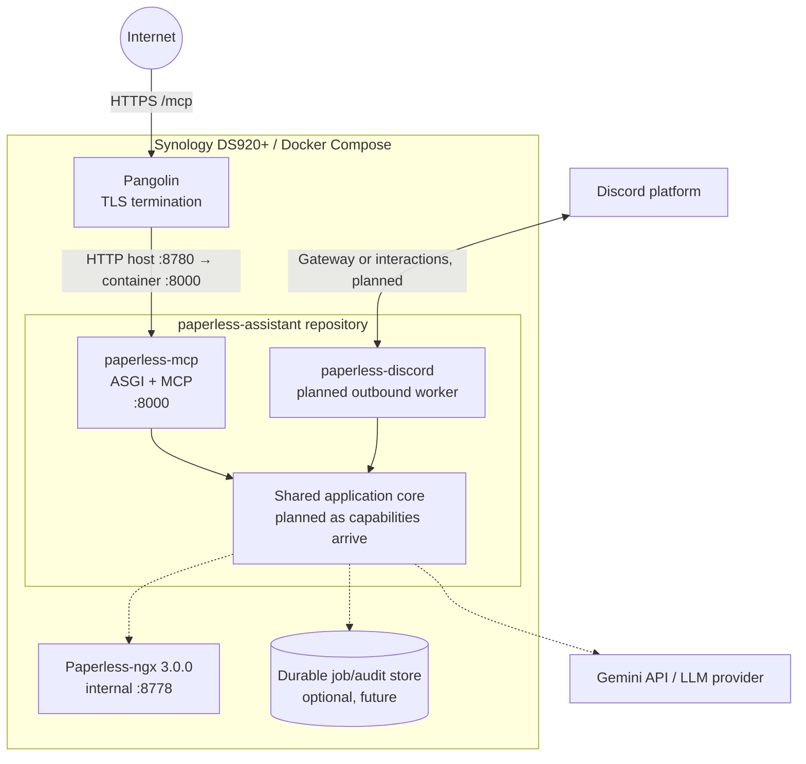

# Paperless Assistant architecture

Status: Phase 0 implemented; later phases are designs, not deployed capabilities.
Last updated: 2026-07-23

## 1. Executive summary

Paperless Assistant is a self-hosted, security-first document-assistant platform. It will provide multiple inbound experiences—initially Gemini Spark over MCP and later Discord—backed by shared application services and bounded Paperless-ngx access. The design is a ports-and-adapters modular monolith: transport handlers translate requests, application services enforce use-case policy, and outbound adapters handle external systems.

Implemented now is only a Phase 0 connectivity probe: public service metadata, liveness/readiness endpoints, stateless MCP Streamable HTTP, and one harmless `ping` tool. It has no authentication because it has no secrets, document data, or side effects. Authentication is a hard prerequisite for document access.

## 2. Goals

- Prove Gemini Spark-compatible MCP connectivity through Pangolin and Docker Compose.
- Share domain and application policy across MCP, Discord, and possible future front ends.
- Introduce Paperless access read-only, least-privilege, bounded, and authenticated.
- Attribute answers to documents and distinguish confirmed content from inference.
- Add delivery, ingestion, and controlled writes only through separately reviewed capability layers.
- Operate on a Synology DS920+ with reproducible builds, meaningful tests, structured logs, and safe rollback.

## 3. Explicit non-goals

Phase 0 does not connect to Paperless, Gemini APIs, Gemini Spark internals, Discord, an identity provider, audit storage, or file storage. It does not answer document questions, upload/download documents, expose OCR, mutate metadata, automate a browser, implement general agents, or create placeholder implementations for those capabilities.

The long-term design does not make Pangolin's interactive browser login an MCP authorization protocol, authorize users by Discord display name, expose permanent unauthenticated file URLs, retry unsafe operations automatically, or allow unbounded natural-language bulk changes.

## 4. Current deployment environment

The target is a Synology DS920+ running x86_64 Linux and Docker Compose. Pangolin terminates TLS. The container listens on port 8000 and Compose maps NAS host port 8780. The planned public MCP endpoint is `https://paperless-mcp.thecolefam.com/mcp`; Pangolin targets `http://<NAS-IP>:8780/mcp`. Paperless-ngx 3.0.0 currently listens internally on NAS port 8778 and is publicly browsable at `https://documents.thecolefam.com`.

Phase 0 runs as a non-root, read-only container with no volumes, dropped capabilities, `no-new-privileges`, bounded temporary storage, and no integration credentials.

## 5. System context

Solid lines are implemented deployment paths; dotted lines are planned. Phase 0 does not connect to Paperless, Discord, an LLM, or audit storage.

## 6. Container and deployment view

Only `paperless-mcp` exists today. The Discord worker and shared capability modules are introduced when their issues are implemented, without making the worker publicly reachable unless HTTP interactions are deliberately selected.

## 7. Trust boundaries

1. **Internet to Pangolin:** untrusted requests cross a TLS boundary. Pangolin supplies transport security, routing, and operational filtering, but not the future MCP application authorization decision.
2. **Pangolin to MCP container:** a private network hop still carries untrusted request content. The application validates Host, Origin, protocol input, tokens, scopes, sizes, and rates.
3. **Application to Paperless:** a credential boundary. Read and write accounts/tokens are separate, never forwarded to clients, and scoped to the minimum practical privilege.
4. **Application to Discord/LLM:** data leaves the NAS. Only approved, necessary, bounded content crosses this boundary; users are informed when ingestion content must reach an LLM.
5. **Temporary and durable storage:** document bytes, audit metadata, and jobs have different retention and access requirements. Temporary files are bounded and promptly removed; audit events exclude full content.
6. **User identity:** Gemini/MCP tokens and immutable Discord user IDs are authorization inputs. Display names, endpoint obscurity, and interactive proxy sessions are not identities.

All external input—queries, IDs, attachment metadata, model-selected calls, proxy headers, and API responses—is untrusted until validated.

## 8. Ports-and-adapters model

The application remains one repository and shared Python package. Conceptual future ports are:

- `DocumentRepository`: bounded search, metadata, text slices, and file streaming.
- `DocumentSearchService`: validates queries and returns normalized attributed matches.
- `DocumentRetrievalService`: enforces document authorization and text/file bounds.
- `DocumentIngestionService`: owns validation, quarantine, confirmation, submission, and task tracking.
- `DocumentMutationService`: owns dry-run, confirmation, idempotency, bounded writes, and audit.
- `LLMProvider`: performs supported model calls without coupling services to Gemini.
- `AuditStore`: persists privacy-minimized, attributable security events.
- `ArtifactDeliveryService`: selects attachment, expiring link, detail link, or refusal.
- `AuthorizationService`: maps authenticated principals and scopes to actions and resources.

Inbound MCP and Discord adapters validate transport concerns and call application services. Outbound Paperless, LLM, audit, and delivery adapters implement ports. The MCP adapter never calls Discord code; Discord never calls MCP tool functions. Interfaces are documented now but created in code only when a real use case consumes them.

## 9. Configuration and secret management

Phase 0 uses typed environment settings with strict validation, clear startup errors, safe loopback defaults, and comma-separated Host/Origin allowlists. `.env.example` contains no secrets; `.env` is ignored. CORS is not enabled.

Production adds `paperless-mcp.thecolefam.com` to `MCP_ALLOWED_HOSTS`. An Origin is added only for a demonstrated browser client requirement. The internal Paperless base URL and public browser URL will be separate settings so API traffic remains private while results can link to `https://documents.thecolefam.com`.

Future secrets come from deployment secret facilities or tightly permissioned runtime environment injection, never image layers, Compose files, logs, tests, issues, or Git. Configuration errors fail startup rather than falling back to permissive behavior. Separate Paperless read and write credentials are mandatory.

## 10. Authentication strategy

The unauthenticated bootstrap is acceptable only while `ping` is the sole MCP tool and no secret or side effect exists. Phase 1 must implement OAuth 2.1-compatible MCP authorization before Phase 2 document tools. The preferred design supports Dynamic Client Registration when practical for Gemini Spark, with a manually configured bearer-token client fallback only where the client and reviewed deployment support it.

Pangolin terminates TLS, while the application validates access tokens, issuer, audience/resource binding, expiry, signature, and required scopes. OAuth metadata and redirect behavior follow the MCP authorization specification. Pangolin's browser login is defense in depth, not the MCP authentication protocol. Tokens are never accepted in query strings or logged.

## 11. Authorization and scopes

Authorization defaults to deny and is evaluated inside the application for every capability. Initial scopes are:

- `paperless.read`: bounded metadata/search/OCR access.
- `paperless.download`: document-file retrieval or delivery.
- `paperless.ingest`: confirmed uploads.
- `paperless.write`: controlled metadata mutations.

Scopes do not replace resource-level policy. Discord has immutable user-ID, guild, and channel allowlists plus separate per-user read/write permissions. Initially only the owner and spouse are allowed. MCP and Discord principals are represented consistently for application authorization and audit attribution.

## 12. Paperless integration plan

Phase 2 uses a dedicated read-only Paperless service account and token. An outbound adapter based on `httpx.AsyncClient` will have explicit connect/read/write/pool timeouts, typed request/response models, token authentication, bounded pagination, bounded OCR slices, and sanitized error mapping. It retries only safe idempotent requests after transient transport, 429, or selected 5xx failures with caps and jitter; authorization and validation failures are never retried.

First bounded operations are `paperless_status`, `search_documents`, `get_document`, `get_documents`, `find_similar_documents`, `list_metadata`, and `get_document_file`. Each receives explicit limits. Search results normalize Paperless ID, title, document date, correspondent, document type, tags, excerpt, and public detail URL. Retrieval accepts offsets and maximum characters and never returns unlimited OCR. Normal logs exclude OCR, binaries, tokens, and raw authorization failures.

The internal API base (for example `http://<NAS-IP>:8778`) is independently configurable from `https://documents.thecolefam.com`.

## 13. Gemini Spark integration plan

Phase 1 registers the public `/mcp` URL as a Gemini Spark custom connected app and verifies initialization, tool discovery, and `ping` using the official client behavior first. The endpoint is stateless Streamable HTTP over Pangolin TLS. Production Host/Origin settings are explicit.

Document tools remain absent until Spark can complete the reviewed OAuth flow and the application validates tokens/scopes. Tool descriptions state bounds and side effects. Spark receives minimal relevant text and source metadata, not a dump of the Paperless corpus. If client limitations require manual credentials, that fallback is documented, rotated, narrowly scoped, and reviewed.

## 14. Discord integration plan

Phase 3 adds a separate `paperless-discord` process/container using the shared core. It connects outbound through the Discord Gateway or uses reviewed HTTP interactions; it is not public by default. It does not automate Gemini Spark. `/ask` uses a supported Gemini API or another provider through `LLMProvider`.

Planned commands are `/ask <question>`, `/search <query>`, `/document <id>`, `/similar <id>`, `/ingest attachment:<file>`, `/tag document:<id> tags:<...>`, and `/title document:<id> title:<...>`. The first Discord phase exposes only read-only commands.

Access control uses immutable Discord user IDs, default-deny owner/spouse allowlists, optional DM or private-family-server restrictions, configurable guild/channel IDs, separate read/write grants, per-user rates, and audit attribution. Display names never authorize. Responses hide confidential error details.

The `/ask` flow authenticates the user, sends the question to an application service, lets the configured model select only bounded retrieval operations, obtains relevant OCR slices and metadata, generates an answer, cites titles/dates/Paperless IDs, distinguishes facts from inferences, never invents absent values, returns a concise answer/source list, and audits metadata without full document text.

## 15. File-return strategy

A future `DeliveryArtifact` represents one of: direct Discord attachment, authenticated short-lived link, Paperless detail link, or refusal. The delivery service rechecks authorization and dynamically observes the attachment-size limit reported by Discord.

Small files stream from Paperless using bounded memory or a permission-restricted temporary file and are removed after delivery. Large files use an authenticated, short-lived, single-purpose link where practical. Permanent unauthenticated download URLs and embedded Paperless tokens are forbidden. Audit events record principal, document ID, method, result, and link expiry—not content.

## 16. Discord ingestion strategy

Phase 5 implements a staged, asynchronous workflow:

1. An approved user invokes `/ingest` with an attachment.
2. `AuthorizationService` verifies the ingest permission and location allowlist.
3. The adapter validates size, sanitized filename, allowed MIME/type signature, and rate.
4. The service computes a checksum while streaming to bounded quarantine storage.
5. It proposes metadata and asks the same user for explicit, expiring confirmation.
6. It uploads once to Paperless with a configurable source tag such as `Source/Discord`.
7. It polls or inspects the Paperless consumption task with a deadline and bounded backoff.
8. It reports success with the new document ID or a sanitized actionable failure.
9. It removes temporary data on success, failure, timeout, or process cleanup.
10. It records an attributable audit event without file content.

Checksums and idempotency keys prevent accidental duplicate submissions. Documents are not sent to an LLM unless the requested operation needs it and the user is informed that content will leave the server.

## 17. Controlled-write strategy

Phase 6 introduces a separate capability layer, disabled by default, with a distinct Paperless write account/token and `paperless.write` scope. Every request names bounded document IDs and allowed fields; wildcard bulk changes through natural language are rejected. The service returns a dry-run diff, requires explicit expiring confirmation, uses idempotency protection, rechecks authorization at execution, records before/after metadata, and reports partial failure clearly.

Rollback restores captured prior metadata when Paperless semantics permit; otherwise the dry run explains irreversibility. Gemini and Discord receive no write tools without a dedicated issue and security review. Delete/replace documents, delete pages, split/merge, corpus-wide reprocessing, ownership/permission changes, and unrestricted share links remain prohibited.

## 18. Audit strategy

Phase 0 emits structured operational logs but no durable audit trail because no protected resource is touched. Future `AuditStore` events include event ID, timestamp, correlation ID, authenticated principal type/ID, adapter, action, scopes, bounded target IDs, policy decision, outcome, latency, error category, delivery method/expiry, and idempotency key where relevant.

Events exclude tokens, authorization headers, OCR, binaries, full questions/answers by default, and unnecessary personal attributes. Before/after values for controlled writes are protected and retention-limited. Append integrity, access control, retention, backup, export, and deletion policies are selected before durable storage is introduced.

## 19. Error handling

Transport adapters map typed application and outbound errors into stable, sanitized client results. Validation and authorization errors do not reveal resource existence. External response bodies are not passed through. Timeouts, transient unavailability, rate limiting, invalid requests, forbidden actions, and internal failures are distinct categories with correlation IDs.

Unexpected exceptions are logged by category and correlation—not private payload—and return a generic error. Readiness reflects whether the process can accept requests, while liveness stays independent of optional downstream outages unless a deployment policy later requires otherwise. Partial multi-item results are explicit and bounded.

## 20. Rate limiting and backpressure

Phase 0 relies on small request bodies, stateless handling, and infrastructure limits; `ping` has negligible cost. Before document access, apply per-principal and global request rates, concurrency limits, MCP body limits, bounded pagination/text, Paperless connection-pool limits, and timeouts. Respect safe `Retry-After` signals.

Discord adds per-user and per-command quotas, attachment bounds, confirmation expiry, and a bounded job queue. When saturated, fail quickly with a retryable response instead of accumulating unbounded memory or work. Writes and ingestion receive lower concurrency and stronger idempotency than reads.

## 21. Observability

Phase 0 logs JSON service startup, version, environment, MCP bootstrap mode, readiness, and graceful shutdown. It exposes `/healthz` and `/readyz` without secrets and requires no external logging service.

Future requests receive a generated correlation ID that is returned where safe and propagated to application calls, outbound requests, jobs, and audit events. Metrics will cover request/tool counts, latency/error categories, authorization denials, rate-limit rejections, Paperless/LLM latency, queue depth, ingestion outcomes, and delivery outcomes. Metrics labels never contain queries, titles, user-supplied filenames, document content, or unbounded IDs. Tracing is optional and privacy-reviewed.

## 22. Data privacy

Minimize data at every boundary. Retrieve only relevant metadata and bounded OCR slices; send an LLM only the content needed for an informed request; do not persist prompts or full responses by default. Never log document content or binary data. Use TLS externally and private networking internally, with authenticated short-lived delivery links.

Temporary file permissions, size quotas, cleanup, backup exclusion, and retention are explicit. Discord answers are concise and suitable only for approved private contexts. Source references allow users to verify answers in Paperless. Data export, deletion, model-provider retention, and jurisdiction questions are resolved before multi-user or durable storage phases.

## 23. Testing strategy

Phase 0 unit tests cover settings defaults and rejection, allowlist parsing, version/bootstrap exposure, and ping schema. HTTP integration tests cover metadata, liveness, lifecycle readiness, content types, 404 behavior, and absence of sensitive output. A real ephemeral Uvicorn server and the official MCP client initialize a session, list exactly `ping`, call it, validate structured output, and shut down. Coverage must remain at least 90%.

Static gates are Ruff lint/format and near-strict mypy. `pip-audit` checks the locked environment. Docker build and Compose smoke tests inspect HTTP JSON, call MCP through the official client, verify health, and assert non-root execution. Future adapters add contract tests with synthetic fixtures, bounded-response tests, authorization matrices, timeout/retry tests, and failure/cleanup/idempotency scenarios. No live private documents enter tests.

## 24. Deployment and rollback

CI produces confidence in a pinned, locked, non-root image. Compose maps `8780:8000`, uses an HTTP health check, a read-only root filesystem, small `/tmp` tmpfs, dropped capabilities, `no-new-privileges`, init handling, and conservative resource bounds. Pangolin maps the external HTTPS MCP path to the NAS host and checks `GET /healthz` for 200.

Deploy immutable image versions after checks, preserve the previous known-good image/Compose configuration, validate health and MCP `ping`, then enable traffic. Rollback selects the previous image/config and restarts; Phase 0 has no database or migration. Future schema or write changes require backward-compatible migration and data rollback plans before deployment.

## 25. Phased roadmap

- **Phase 0 — implemented now:** bootstrap MCP `ping`, HTTP health/readiness, hardened Docker Compose, CI, governance, and architecture.
- **Phase 1 — planned next:** production MCP authentication, Gemini Spark connection test, and security validation.
- **Phase 2 — planned:** dedicated read-only Paperless account, async API client, search/retrieval tools, source attribution, and bounded OCR.
- **Phase 3 — planned:** read-only Discord worker, approved-user allowlist, search/Q&A, and supported Gemini API provider.
- **Phase 4 — planned:** document/file delivery, secure short-lived links, and delivery auditing.
- **Phase 5 — planned:** Discord ingestion, confirmation, Paperless task tracking, and temporary-file controls.
- **Phase 6 — planned:** controlled metadata writes, separate credentials/scopes, dry runs/confirmations, and before/after audit history.
- **Phase 7 — possible future work:** optional multi-user authorization, per-user Paperless permissions, durable jobs/audit storage, and operational dashboards.

Each phase begins with an issue and security/privacy review. Later phase descriptions are not commitments that code exists.

## 26. Known risks

- Gemini Spark authorization capabilities and MCP client behavior can change; test against current official behavior before exposing data.
- Reverse-proxy Host/Origin rewriting can conflict with DNS-rebinding allowlists; use explicit configuration and end-to-end tests.
- Paperless 3.0.0 API behavior may differ from newer documentation; pin contract expectations and test the deployed version.
- OCR and LLM answers can be incomplete or misleading; bound context, cite sources, label inference, and never invent values.
- Prompt injection in documents can attempt tool misuse; application authorization and hard capability bounds must override model instructions.
- Discord accounts, channels, attachments, and links can leak data; immutable allowlists, short expiry, minimal content, and audit reduce impact.
- NAS CPU/memory and external API limits are constrained; concurrency, timeouts, queues, and backpressure are necessary.
- Temporary-file cleanup can fail after crashes; bounded dedicated storage and startup scavenging are required before ingestion.
- Separate read/write credentials reduce but do not eliminate Paperless blast radius.

## 27. Open architectural questions

- Which OAuth authorization server and token format best satisfy Gemini Spark, self-hosting, and household administration?
- Does Gemini Spark support DCR and the required resource indicators reliably in the intended account tier?
- Should authenticated file delivery be implemented by Paperless shares, a dedicated signed-link service, or proxy streaming?
- Which Paperless 3.0.0 endpoints and permissions support the proposed least-privilege read/write split?
- Which Gemini API data-retention controls and regional terms are acceptable for private document Q&A?
- Should Discord use Gateway commands or HTTP interactions for the target NAS/network topology?
- What durable store, retention, backup, and tamper-evidence model should audit and ingestion jobs use?
- How should per-document Paperless permissions map to future multi-user MCP and Discord principals?
- What explicit resource budgets are appropriate on the DS920+ under concurrent OCR retrieval and LLM work?

These questions become scoped issues before the affected phase.

## 28. Architecture Decision Record process

Consequential, durable decisions are recorded in `docs/adr/` using sequential four-digit names. Each ADR states Status, Context, Decision, Consequences, and Alternatives considered. A proposed ADR is discussed with its issue; accepted ADRs merge with the implementation or architecture change they govern. Accepted records are immutable except for typo/clarity fixes: changed decisions create a new ADR that marks the earlier record superseded and links both directions.

Agents and contributors read applicable ADRs before changing architecture. ADRs distinguish implemented behavior from plans and never claim a future component exists. Current records cover Python/uv, ports-and-adapters, stateless Streamable HTTP, read-only-first capabilities, and the separate Discord worker.
